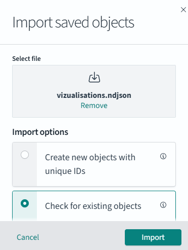
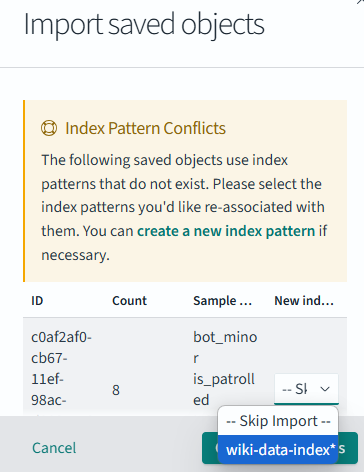
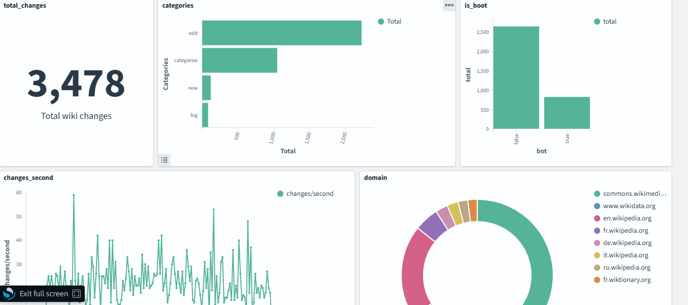
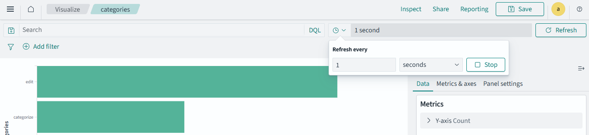

# Objectifs

Dans ce projet on a comme objectif la création d'un dashboard en temps réel reflétant les récent changement opérés sur les Wiki.

# Installations
Pour bien éxécuter le code voici les différentes étapes à suivre:
- docker-compose up -d
- Ensuite se connecter au http://localhost:5601
username: admin , password:Pwc22129.@
- importer les fichiers dans saved_objects dans opensearch-dashboard
  - Etapes pour importer un fichier
    - DashboardManagement > Saved objects > appuyer sur import
    - il faut choisir le second option pour les options d'importations
      
    - ##### NB: dans un cas de conflit pour importations des visualisations voici comment faire:
       - il faut choisir au niveau du champ new index wiki-data-index
         
  - ##### NB: il faut importer en premier wiki-data-index
- éxécuter le producer puis le consumer

# Désinstaller

- docker-compose down -v

# le dashboard
chemin d'acces: Opensearch-dashboard/visualize/wiki_dashboard

Pour avoir le dashboard en temps il faut activer le refresh time pour une visualisation.

Chemin d'acces: Opensearch-dashboard/visualize

